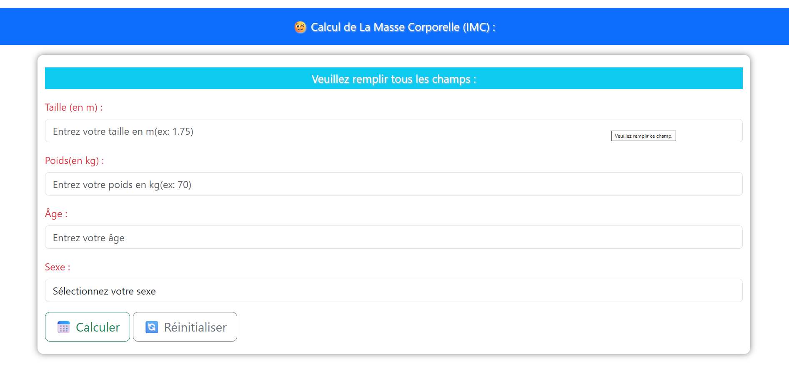

# 🧮 Calcul de la Masse Corporelle (IMC) - Go Web App

Une petite application web développée en **Golang** permettant de calculer l'Indice de Masse Corporelle (IMC) à partir de la taille, du poids, de l'âge et du sexe de l'utilisateur.

## 📸 Capture d'écran



---

## ✨ Fonctionnalités

- Interface moderne et responsive
- Saisie de la taille, du poids, de l'âge et du sexe
- Calcul automatique de l'IMC
- Bouton de réinitialisation du formulaire
- Validation des champs
- Développé avec le langage Go

---

## 🧮 Formule utilisée

```text
IMC = Poids (kg) / Taille² (m)
```

Exemple :

```text
Poids : 60 kg
Taille : 1.75 m

IMC = 60 / (1.75 × 1.75)
IMC = 19.59
```

---

## 📊 Interprétation de l'IMC

| IMC | Interprétation |
|-----|----------------|
| < 18.5 | Maigreur |
| 18.5 - 24.9 | Poids normal |
| 25 - 29.9 | Surpoids |
| ≥ 30 | Obésité |

---

## 🛠️ Technologies utilisées

- Golang
- HTML5
- Bootstrap 5

---

## 🚀 Installation

### Cloner le projet

```bash
git clone https://github.com/yahiagaied/imc-go-app.git
```

### Accéder au dossier

```bash
cd imc-go-app
```

### Lancer l'application

```bash
go run main.go
```

Ouvrir ensuite :

```text
http://localhost:8080
```

---

## 📂 Structure du projet

```text
imc-go-app/
│
├── main1.go
├── templates/
│     |── index.html
|     └── traitement.html
├── screenshot.png
└── README.md
```

---

## 🎯 Objectifs du projet

Ce projet a été réalisé afin de :

- pratiquer le développement web avec Go ;
- utiliser les templates HTML ;
- améliorer mes compétences en Bootstrap ;
- créer une interface utilisateur moderne.

---

## 🔮 Améliorations futures

- Historique des calculs
- Export PDF
- Multilingue (Français / Arabe / Anglais)
- Calcul des calories journalières
- Calcul du poids idéal

---

## 👨‍💻 Auteur

Développé avec ❤️ par **Yahia Gaied**

Passionné par :

- Golang 💻
- Développement Web 🌐
- Musculation 🏋️

---

## ⭐ Si ce projet vous plaît

N'hésitez pas à laisser une étoile ⭐ sur le dépôt GitHub.